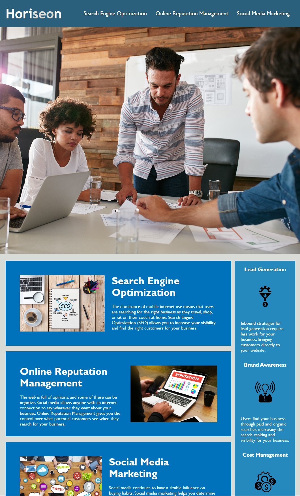

# Horiseon-accessibility-improvement

## Description 

This project's main aim was to increase the accessibility of a webpage for The Horiseon Marketing agency whilst ensuring that the layout/design of the website is unchanged. The marketing agency wanted their codebase to follow accessibility standards and to improve their SEO. This will allow their webpage to appear higher in search engine results allowing it to be more accessible for users and people searching for their services. The changes made include:

- Refactoring the HTML file to include semantic tags.
- Organising the HTML elements so that they follow a logical structure, independent of styling and positioning.
- Added accessible 'alt' attributes to images and icons.
- Included a consise and descriptive title element.

Also, the style.css file was reworked to consolidate redundant CSS selectors and properties and comments were added to help organise and give context to each selector.

The final product can be viewed using the deployed link below:

https://arfinxx.github.io/Horiseon-accessibility-improvement

## Installation

N/A

## Usage 

Here is a screenshot of the final webpage:

md

## Credits

EdX Front-End Development Bootcamp starter code

## License

Please View License in Repository
